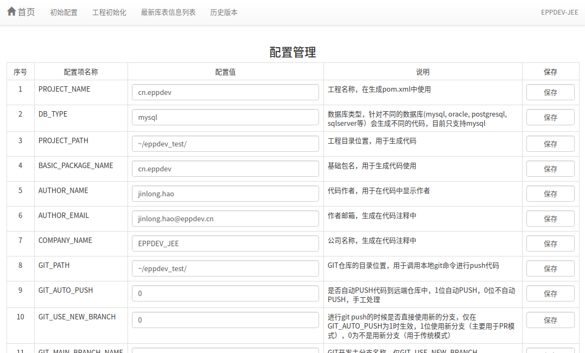
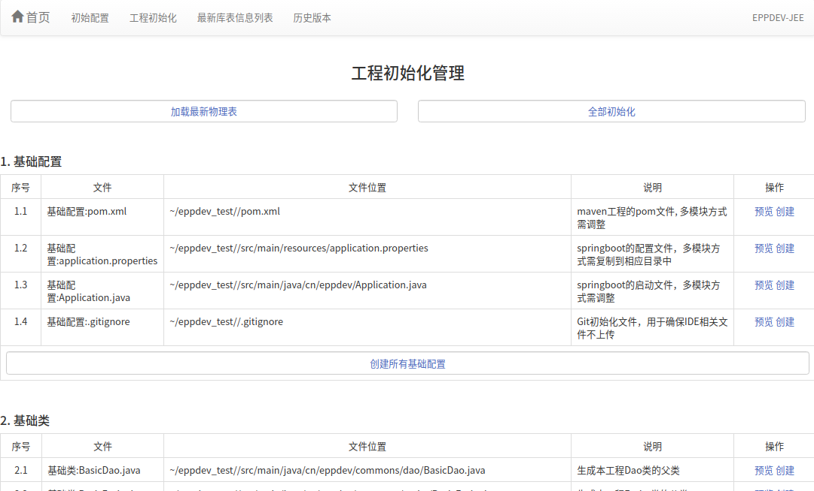
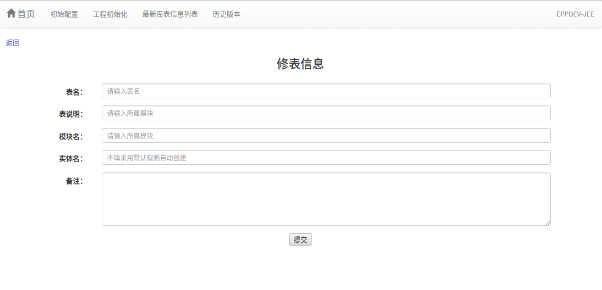
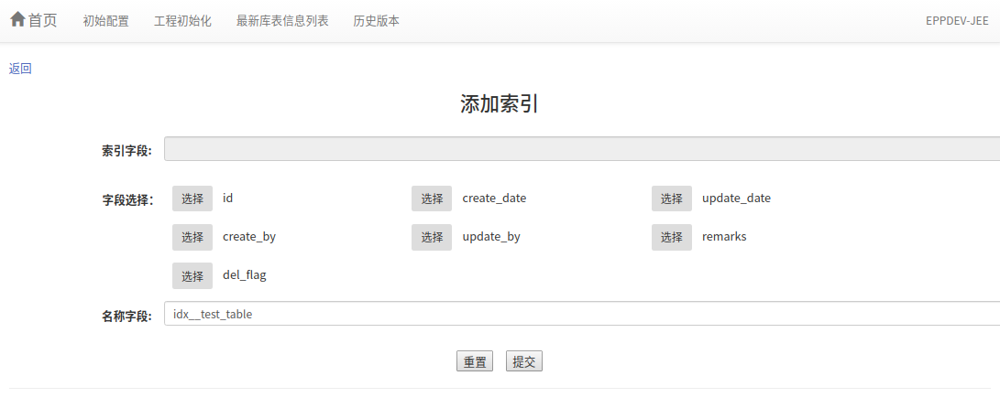

---
title: EPPDEV-JEE系统操作手册
version: V1.6
file-code: EPPDEV-JEE-USAGE-01
header-right: 2019-09
company: 郝金隆
date: 2019-09
...

# 文档概述

## 文档说明

本文是EPPDEV-JEE代码生成系统的使用说明，主要内容包括：

1. 平台的下载、安装与启动
2. 使用前的基础配置
3. 代码的生成
4. 生成的代码架构说明
5. 旧版本升级说明

## 参考文件

暂无

## 保密及知识产权要求

EPPDEV-JEE代码生成系统是由郝金隆个人开发的开源软件，
采用[Anti-996 License](https://github.com/996icu/996.ICU/blob/master/LICENSE)
V1.0[^anti-996]协议对外发布。
本文知识产权归属郝金隆个人所有，但是同样采用相同协议对外发布。
任何符合该协议的企业、团体和个人，均可在本文的基础上进行二次修改和对外分发。

[^anti-996]: 参见https://github.com/996icu/996.ICU/blob/master/LICENSE

# 下载与安装

## 环境准备

系统编译运行所必须的环境主要包括：

1. Java 1.8+
2. MySQL/MariaDB 5.5+
3. Maven 3.5+ [^maven]

[^maven]: Maven仅用于编译安装使用

## 程序下载

程序下载有以下两种方式：

### 直接下载打包号的程序文件

本程序的正式发布地址为：[https://github.com/eppdev/eppdev-jee-pom/releases](https://github.com/eppdev/eppdev-jee-pom/releases)，
要下载的内容文件包括：

1. eppdev-jee-web-x.y.z.jar[^version] : 已打包号的程序文件
2. application.properties : 主要是一些基础配置文件

[^version]:x.y.z表示的程序的版本号，具体下载时可以下载最新的版本

> 上述两个文件下载以后，需要放到同一个文件夹下

### 通过源代码进行安装使用

源代码仓库位于：

* Github: [https://github.com/eppdev/eppdev-jee-pom](https://github.com/eppdev/eppdev-jee-pom)
* Gitee: [https://gitee.com/eppdev/eppdev-jee-pom](https://gitee.com/eppdev/eppdev-jee-pom)

任何人均可以从上述两个代码仓库下载并自行编译本系统，以github为例：

~~~shell
git clone https://github.com/eppdev/eppdev-jee-pom.git
cd eppdev-jee-pom
mvn -Dmaven.test.skip=true package
~~~

> 注意：编译安装需要Java和Maven环境

编译完成后，需要将以下两个文件复制到同一个文件夹下：

1. eppdev-jee-web/target/文件夹下的eppdev-jee-web-x.y.z.jar文件
2. eppdev-jee-web/src/main/resources/application.properties文件

# 使用前的基础配置

## 数据库环境准备

已有数据库环境的可以跳过此章节。若无数据库环境，则需首先需要创建一个数据库schema，
并对其进行权限配置，示例如下：

~~~sql
create database test_db charset utf8;
grant all privileges on test_db.* to 'eppdev'@localhost identified by 'eppdev';
flush privileges;
~~~

> 注：上述sql完成了test_db数据库的创建，并将其所有权限赋予了密码为eppdev的eppdev用户
> 具体的schema名称、用户名、密码可以根据实际需要进行修改

## 修改application.properties文件

根据需要修改application.properties文件，主要修改项目包括：

1. spring.datasource.url: 数据库连接地址
2. spring.datasource.username: 数据库用户名
3. spring.datasource.password: 数据库连接密码
4. eppdev.author.name: 在生成的代码注释中的作者名称，建议写成自己的名字
5. eppdev.project.path: 要生成的代码所在的目录，写成自己本地的目录绝对地址

> 针对个人开发，4、5最后两项可以不在application.properties中配置，在平台启动后的界面配置即可。
> 但若是多人协作开发，建议每个人在自己的本地单独配置不同的作者名、工程地址，
> 以避免某一人修改配置后对其他人的影响

# 代码生成

## 启动代码生成程序

### windows下的启动

~~~shell
java -jar -Dfile.encoding=UTF-8 ./eppdev-jee-web-x.y.z.jar
~~~

>注：此处需通过指定file.encoding以避免生成代码的乱码问题

### Linux/Mac下的启动

Linux和Mac下可以首先将下载的jar包转换为可执行程序，后续只需要直接执行即可

~~~shell
chmod a+x ./eppdev-jee-web-x.y.z.jar
./eppdev-jee-web-x.y.z.jar
~~~

## 启动后的基础配置

系统启动后通过浏览器打开[http://localhost:8080/](http://localhost:8080)[^address]，
即可访问本系统，界面如下图所示：

[^address]: 若在application.properties中配置了不同的端口，则需要对应修改访问地址

点击顶部菜单中的初始化配置链接，即可进入初始化配置页面，进行初始化配置，如下图所示：

主要需要修改的配置包括：

* PROJECT_NAME: 工程名称
* PROJECT_PATH: 要生成的代码所在位置
* BASIC_PACKAGE_NAME: 要生成的代码的基础包名
* AUTHOR_NAME: 生成的代码注释中的author
* COMPANY_NAME: 公司名称，用于展示在注释中
* LICENSE_DESC: 软件许可说明，展示在注释中

更多的配置项说明，参见界面上的说明。

> 注：针对协作开发，建议直接在application.properties文件中修改配置eppdev.author.name，
eppdev.project.path，则PROJECT_PATH、AUTHOR_NAME在web页面不起作用，以区分不同的使用者

## 生成基础代码

点击web页面中的工程初始化菜单，即可进入工程初始化界面，如下图所示：

在界面中可以初始化 通用代码，具体初始化内容包括：

* 工程基础配置，包括pom.xml, application.properties, Application.java, .gitignore等文件
* 基础类，针对每个表要生成的代码的父类
* 工具类，主要是生成的代码所依赖的一些工具类
* 测试配置，主要是要生成的Test代码所依赖的一些工具类

在此页面可以选择一次性全部生成，也可以选择分类生成，还可以单个文件依次生成。

> 注意在生成相应的代码前，可以先预览以下具体要生成的内容，确认一些具体的代码路径，避免错误出现

## 库表信息配置

### 新增库表信息

#### 添加库表

点击最新库表信息菜单，选择新增表按钮，即可进入库表添加库表页面，如下图所示：

主要要填写的内容包括：

* 表名：即要生成的库表的名称[^tablename]，根据规则会生成对应的Java对象名称
* 表说明：用于生成表注释
* 模块名：用于将生成的代码区分到不同的java包中
* 实体名：默认一般不填，根据规则[^mappingrule]自动生成

[^tablename]: 建议全部用小写字母，下划线分割，如test_table

[^mappingrule]: 系统会自动将表名转换成驼峰形的Java类名，如test_table会自动对应为TestTable

根据提示填写相关内容以后，点击提交按钮即可完成库表的添加，添加库表的过程中，
系统会自动创建id、create_date、create_by、update_date、update_by、del_flag、
remarks这六个技术字段

#### 新增字段

创建完成库表成功后，页面会自动转到库表详情页面，如下图所示：

在此页面中可以查看并添加字段，配置库表的索引，进行代码生成，查看修订记录。
在字段列表中点击添加链接，即可进入新增字段页面，具体如下图所示：

在此页面可以配置内容包括：

1. 基础属性：包括字段名、字段类型、字段长度等信息
2. 查询条件：主要影响到未来是否可以按本字段的相关信息进行查询
3. GroupBy结果：主要影响到未来生成的listGroupBy方法中是否有本字段对应的信息

相关信息填写完成后，提交保存即可。

#### 配置索引

库表详情页面，索引列表中点击添加链接，即可配置库表的索引，如下图所示：

在此页面中依次选择要创建的索引字段，选择提交后即可完成索引的配置

### 自动加载原有库表

#### 加载物理表

系统还可以自动读取平台已有的库表信息，在工程初始化页面点击加载最新物理表链接，
即可进入物理表加载页面，如下图所示：

在此页面可选择加载所有的物理表，也可以选择单个表进行加载。

#### 加载后的配置

为保证加载后库表对应的代码的可用性，一般需要对每个表的信息进行配置，
主要配置内容是每个字段对应的信息，包括

* 基础信息：主要确认自动映射的结果是否正确
* 查询条件和结果：主要用于配置具体要生成的内容，包括本字段是否要生成相关查询条件和GroupBy结果

## 库表对应的代码生成

生成对应的代码，可以采用两种模式来生成：

1. 在库表详情页面，可以生成针对本表的所有代码，可以选择一次性生成所有代码，也可以选择仅生成单项代码
2. 在历史版本页面，可以选择生成所有表对应的代码

# 附录

## 生成的代码说明

具体会生成的内容包括：

* 每个表对应的生成文件（以sys_user表为例）
  * _SysUser.java：自动生成Java类，继承BasicEntity类，实现各个字段到Java属性的映射
  * SysUser.java：实际使用的Java实体类，继承自_SysUser，自定义属性可以在此添加
  * _SysUserDao.java：自动生成的Dao文件，继承自BasicDao，实现各基础调用方法
  * SysUserDao.java：实际使用的Dao文件，继承自_SysUserDao，自定义DAO方法可以在此定义
  * _SysUserParam.java：自动生成的查询条件类，根据库表中各个字段的配置，自动生成
  * SysUserParam.java：实际使用的查询条件类，继承自_SysUserParam，自定义的条件可以在此添加
  * _SysUserService.java：自动生成的Service类，继承自BasicService，实现了exists()、getDao()方法
  * SysUserService.java：使用使用的Service类，需自定义customInit方法，有需要增加的方法可以在此处理
  * SysUserController.java：对应的RestController，实现了基础的增删改查操作
  * sys_user.sql：基础的库表定义文件
* 基础类类文件
  * BasicDao.java: 定义了基础的Dao方法
  * BasicEntity.java：定义了OR映射实体类的基础字段和方法
  * BasicService.java：定义了Service的基础方法
  * BasicParam.java: 定义了条件类的基础属性和方法，包括排序条件的构建等
  * BasicController.java：定义了Controller的基础方法，包括增删改查等操作
* 一些工具类
  * StringUtils.java
  * JsonUtils.java
  * PasswordUtils.java
  * RandomUtils.java
* 基础配置文件
  * pom.xml：maven工程的基础配置
  * application.properties：springboot配置文件
  * Application.java：springboot的启动文件
  * .gitignore：git配置文件
* 测试相关代码
  * ApplicationTest.java
  * applicataion_test.properties

> 对于每个表，之所以在Entity、Param、Dao、Service和Mapper文件都要分两个，是为了区分自动生成以后要根据数据库配置自动更新的代码文件和可以手工修改的文件。
> 有下划线的文件都是后续自动生成的时候要自动修改覆盖的文件，无下划线的是可以手工修改的，后续的自动代码生成不会覆盖。

## 历史版本修订记录

### V1

2019年1月第一次正式发布，主要完成内容：

* 在很久以前写的代码生成器基础上，采用FreeMarker进行了代码的改造
* 将可以个性化定制修改的代码和不能手工修改（重新生成后会覆盖）的代码的分离
* 将查询参数从映射的实体类中分离，实现查询参数的可定制化

### V1.1

2019年2月完成的小版本优化，主要完成内容包括：

* 针对单机版实现本地配置覆盖服务器通用配置，支持多人同时进行代码生成

### V1.2

2019年3月完成的bugfix，主要修改内容：

* 针对插入或修改前的逻辑主键判断，只查询一条数据，避免因逻辑主键为空导致获取到大量的数据问题
* 增加996ICU License

### V1.3

2019年5月完成的小版本升级，主要内容：

* 自动生成Test相关内容

### V1.4

2019年5月完成的小版本升级，主要内容：

* 增加单个物理库表更新加载功能

### V1.4.1

2019年5月完成的bugfix，主要内容：

* 解决_minParam参数中的set方法命名错误问题

### V1.5

2019年8月完成的小版本升级，主要内容：

* 增加了库表修改日志的记录
* 生成的代码中增加了修改日志的注释

### V1.6

2019年9月完成的小版本升级，主要内容：

* 增加自动生成listGroupBy方法的相关操作

